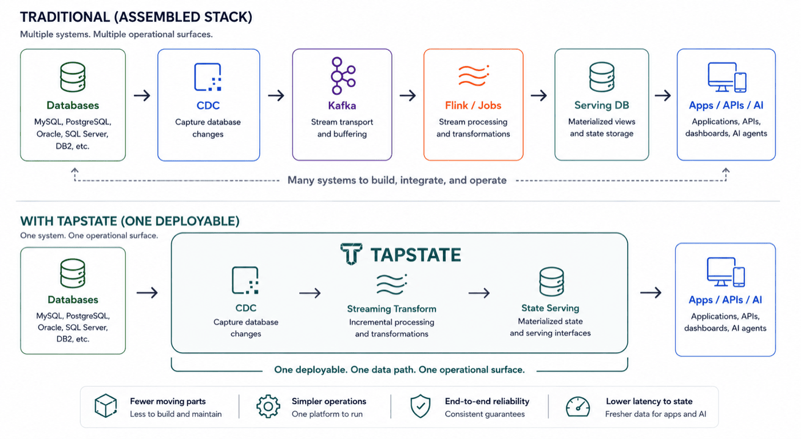

# tapstate

**Capture. Transform. Serve. One deployable.**

Tapstate is an open-source **unified operational data engine** that turns database
changes into live, application-ready state.

```text
Production databases → Capture → Transform → Live state → Apps / APIs / AI agents
```

Instead of assembling CDC, streaming, stream processing, and serving infrastructure,
Tapstate brings the source-to-state path under one product boundary.

Kafka moves events. Warehouses analyze history. Tapstate turns database truth into
live operational state.

## Why Tapstate



A typical operational data path chains a database, CDC, Kafka, Flink or custom jobs,
and a serving database before an application sees anything. Tapstate collapses that
into one deployable.

One data path. One operational surface.

- **Capture** database changes using log-based CDC.
- **Transform** and combine data incrementally as it changes.
- **Serve** application-ready state to applications, APIs, automation, and AI agents.

For how this compares with a streaming stack you assemble yourself, see
[Tapstate vs. a streaming stack](https://tapstate.dev/docs/overview/vs-streaming-stack).

## Try it

Run the Alpha locally:

```sh
curl -sSL https://install.tapstate.dev | sh
```

The demo starts MySQL, PostgreSQL, Tapstate, and MongoDB, then maintains a live order
object assembled from both source databases. Change the source data and watch the
state update.

→ [Follow the quickstart](https://tapstate.dev/docs/overview/quickstart-online)

## What it's for

Tapstate maintains fresh operational state for applications and AI:

- **AI agents and copilots** — give agents fresh business context grounded in operational systems
- **Customer and account 360** — maintain a current view across systems
- **Order and fulfillment state** — assemble live state as orders, payments, and shipments change
- **Inventory and entitlement** — keep availability and access state current
- **Operational data APIs** — serve application-ready state without querying multiple systems of record
- **Core-system offloading** — move read workloads away from transactional systems

Tapstate focuses on workloads whose primary outcome is current operational state,
rather than general-purpose event streaming or historical analytics.

## Alpha preview

Today you can:

- Capture MySQL and PostgreSQL data with initial load + CDC
- Incrementally transform and combine data across sources
- Materialize live state to MongoDB
- Inspect pipeline status, metrics, and logs

That MongoDB ships with the install and is managed by Tapstate: you do not install it,
supply a URI, or configure its namespaces and indexes. It is the current reference
backing store — not a claim that Tapstate is MongoDB-only, and not a managed
production database service.

Alpha is single-node and not production-ready. It does not yet provide high
availability, durable offset resume, exactly-once guarantees, a stable State Data API,
or push/subscription delivery.

**The bundled store is not a security boundary.** It runs without authentication, and
Tapstate's own control-plane data — users, tokens, audit records, connection
configuration, applied artifacts — shares that instance with whatever your pipelines
write, so anyone holding a Tapstate token can read it back with an ordinary source
declaration. Do not put data in this deployment that its own users should not see.

## Where we're going

Alpha proves the core path from database changes to maintained state.

Tapstate is evolving toward the complete Capture → Transform → Serve path:

- Broader database support, including Oracle, SQL Server, MongoDB, DB2, and other common operational data sources
- Production-grade durability and high availability
- Pull and push interfaces for consuming live state
- A broader connector ecosystem for operational systems and serving targets

## Explore Tapstate

- [Quickstart](https://tapstate.dev/docs/overview/quickstart-online) — get Tapstate running and see live state update
- [Concepts](https://tapstate.dev/docs/concepts/dsl) — understand sources, pipelines, resources, and the Tapstate DSL
- [Architecture](https://tapstate.dev/docs/overview/architecture) — understand the Capture → Transform → Serve architecture
- [Connectors](https://tapstate.dev/docs/connectors) — supported databases, capabilities, and capture modes
- [Transforms](https://tapstate.dev/docs/reference/transforms) — reshape and assemble operational state
- [Operations](https://tapstate.dev/docs/guides/observe-a-pipeline) — pipelines, status, metrics, logs, and runtime behavior
- [MCP & AI](https://tapstate.dev/docs/reference/mcp) — use Tapstate with AI agents and developer tools
- [Build & contribute](CONTRIBUTING.md) — build from source and contribute to Tapstate

[tapstate.dev/docs](https://tapstate.dev/docs) is the reviewed, published documentation
and the one to read. Pages under `docs/` in this repository are engineering drafts kept
next to the code, useful when you are working on Tapstate itself.

**For agents and retrieval tooling:** [`/llms.txt`](https://tapstate.dev/llms.txt) is a
discovery index of the documentation, and
[`/llms-full.txt`](https://tapstate.dev/llms-full.txt) carries the combined page
context. Prefer them over crawling this repository — they carry the reviewed wording,
including the line between what Alpha does today and where the product is going.

## About

Tapstate is an Apache-2.0 open-source project from the team behind TapData, built on
years of production CDC and real-time data movement experience.
